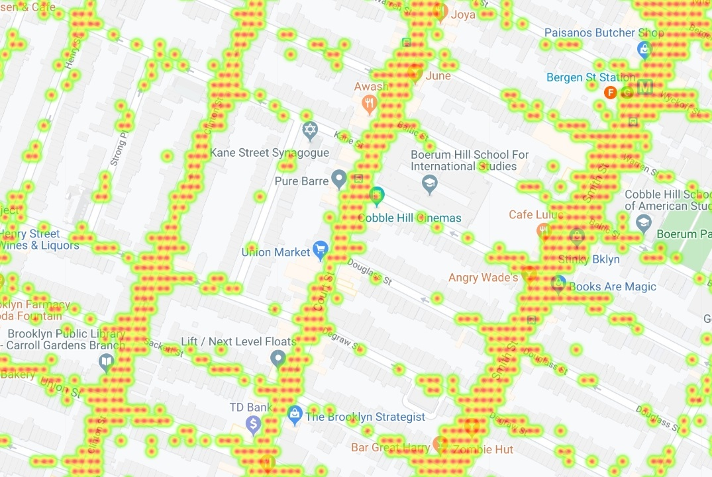
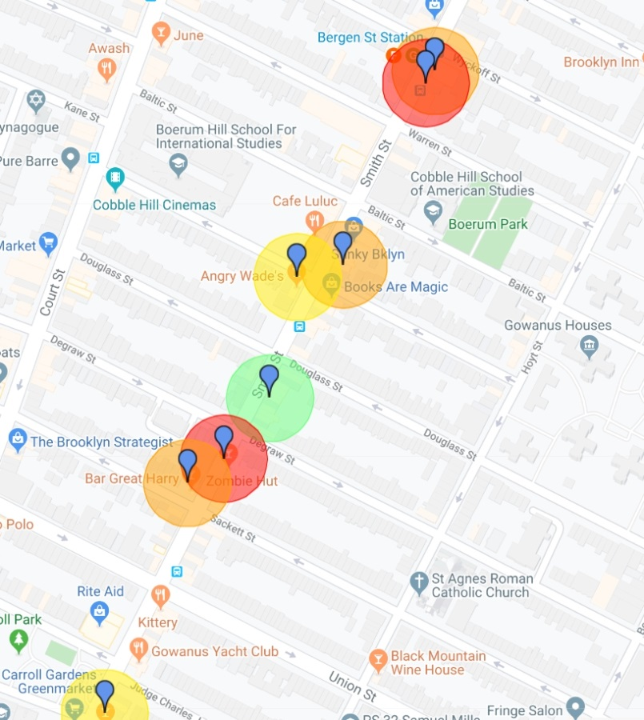
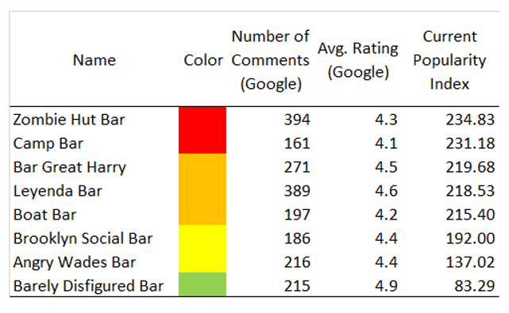

# NYC_Nightlife

### About

My project proposal is a web page that aggregates the available information on NYC nightlife that exists in the web and that uses modern data visualization and machine learning techniques to provide the user (in this case a person or group planning his night out) with the exact information they require. This includes information on trending places by neighborhood (where people are actually going), an inhouse ranking of bars and nightclubs based on a weighted average of different ratings and rankings across the web, personalized suggestions using a recommender system, etc.

For this particular exercise we process the NYC Taxi data using Google Big Query and see if an exploratory analysis can help answer wich bars are trending based on pick-ups. 

<h3>
Using Geolocation Taxi Data
</h3>

Geolocation data contains information of the location from an electronic device, stored in terms of its latitude and logitude. In this document we are going to work with geolocation taxi data and show how it can be used for a variety of pourposes different from what it was originally conceived for.
 

We are going to foccuss initially on data from New York City. We are going to display the data on a Google map using the JavaScript API. More information on how to retrieve this data can be found on <a href="https://console.cloud.google.com/marketplace/details/city-of-new-york/nyc-tlc-trips">NYC TLC Trips</a>. Information on how to use Google's API for customizing maps and diplaying them can be found on: <a href="https://developers.google.com/maps/documentation/javascript/tutorial">Google API</a> 

<h3>New York Nightlife Data</h3>

The city of New York through the Taxi & Limousine Commission, offers open access to data of taxi trips in the city. This data include fields capturing pick-up and drop-off dates/times, pick-up and drop-off locations, trip distances, itemized fares, rate types, payment types, and driver-reported passenger counts.
  
    

In this study we will analyze the nightlife movement on the Brooklyn Carroll Gardens - Cobble Hill neighborhood. For this we extract data from pick-up locations in the area (from 12pm to 4 am) and plot it using a heatmap with red colors representing the number of pick-ups per area. The resulting image, displayed on Google maps is as follows:
 

    

  The data shows us how late pick-ups are mainly concentrated on avenues rather than streets but there is no clear pattern on a preference regarding locations. TTo see if this data can help us answer which bars are trending based on late pick-ups, we are going to use the monthly average from the number of passengers requesting a nightly pick-up in a 40 meter radius (80 meters is the average length of a NYC block) from the bar. 

 

Thinking practically, lets suppose a person wants to go out in the Brooklyn-Carroll neighborhood, and wants to see what bars are trending. For this pourpose, selects 10 bars and wants to rate them using this data. In this example the selected bars are:

* <a href="https://www.google.com/search?rlz=1C1CHBF_enUS831US831&sxsrf=ACYBGNQ_EWKjPDDtVLC1EMWquPtm0oj9sw:1580748595867&q=boat+bar+nyc+brooklyn&npsic=0&rflfq=1&rlha=0&rllag=40703043,-74003470,2190&tbm=lcl&ved=2ahUKEwjFsqS067XnAhWrlXIEHbFrDmwQtgN6BAgLEAQ&tbs=lrf:!1m4!1u3!2m2!3m1!1e1!1m4!1u2!2m2!2m1!1e1!1m4!1u1!2m2!1m1!1e1!1m4!1u1!2m2!1m1!1e2!1m4!1u15!2m2!15m1!1shas_1takeout!1m4!1u15!2m2!15m1!1sserves_1beer!1m4!1u15!2m2!15m1!1sserves_1wine!1m4!1u15!2m2!15m1!1saccepts_1reservations!1m4!1u15!2m2!15m1!1sfeels_1romantic!1m4!1u22!2m2!21m1!1e1!1m5!1u15!2m2!15m1!1shas_1seating_1outdoors!4e2!1m5!1u15!2m2!15m1!1shas_1wheelchair_1accessible_1entrance!4e2!1m5!1u15!2m2!15m1!1spopular_1with_1tourists!4e2!1m5!1u15!2m2!15m1!1sserves_1brunch!4e2!1m5!1u15!2m2!15m1!1sserves_1dinner!4e2!1m5!1u15!2m2!15m1!1sserves_1breakfast!4e2!1m5!1u15!2m2!15m1!1sserves_1lunch!4e2!2m1!1e2!2m1!1e1!2m1!1e3!3sIAE,lf:1,lf_ui:9&rldoc=1#rlfi=hd:;si:8320494282809763096;mv:[[40.7318226,-73.9559226],[40.683184,-74.019458]]">Boat Bar</a>
* <a href="https://www.google.com/search?rlz=1C1CHBF_enUS831US831&tbm=lcl&sxsrf=ACYBGNRMxyopkcM8-VBaHwHZ3pxOfzzQBQ%3A1580748689871&ei=kU84XvHdNOmqytMPx8mtiAM&q=camp+bar+brooklyn&oq=Camp+Bar+&gs_l=psy-ab.1.0.35i39k1j0i203k1l9.19623.21189.0.23022.2.2.0.0.0.0.115.202.1j1.2.0....0...1c.1.64.psy-ab..0.2.201....0.m_VLX7ET3uc#rlfi=hd:;si:18405725459997843743;mv:[[40.685893877319025,-73.99075435587069],[40.68553392268097,-73.99122904412931]]">Camp Bar</a>
* <a href="https://www.google.com/search?rlz=1C1CHBF_enUS831US831&tbm=lcl&sxsrf=ACYBGNTiAc2eapD0R5I6eP4Tc2bteYz-Kw%3A1580748613896&ei=RU84XtmsNuOwytMPlOCGgAo&q=leyenda+bar+brooklyn&oq=leyenda+bar+b&gs_l=psy-ab.1.0.0i203k1j0i22i30k1l5.152728.155451.0.157132.13.13.0.0.0.0.185.1260.3j7.10.0....0...1c.1.64.psy-ab..3.10.1260...0j35i39k1j0i67k1j0i10i203k1j0i22i10i30k1.0.IqVWLAr1BtI#rlfi=hd:;si:2207491020729504187;mv:[[40.68444667731904,-73.99166066102435],[40.68408672268097,-73.99213533897563]]">Leyenda Bar</a>
* <a href="https://www.google.com/search?rlz=1C1CHBF_enUS831US831&tbm=lcl&sxsrf=ACYBGNQksjsJH-26AfhUPVjR4GHcQSxrbw%3A1580748713827&ei=qU84XueQMvyfytMP7fiJuAw&q=angry+wade%27s+bar+brooklyn&oq=Angry+Wades+Bar&gs_l=psy-ab.1.1.0i10i203k1j0i22i30k1j0i22i10i30k1.138504.138504.0.140795.1.1.0.0.0.0.132.132.0j1.1.0....0...1c.1.64.psy-ab..0.1.131....0.-HnqpggcH0U#rlfi=hd:;si:12369966179634669595;mv:[[40.68425957731903,-73.99217326169062],[40.68389962268097,-73.99264793830937]]">Angry Wade's Bar</a>
* <a href="https://www.google.com/search?rlz=1C1CHBF_enUS831US831&tbm=lcl&sxsrf=ACYBGNQQ-xpHDQ0OzZxIBSHdYzq-5Z1WnA%3A1580748855360&ei=N1A4XoPIFeGGytMPjJ2HmAU&q=Barely+Disfigured+Bar+&oq=Barely+Disfigured+Bar+&gs_l=psy-ab.3..0i203k1j0i22i30k1.34892.34892.0.35749.1.1.0.0.0.0.81.81.1.1.0....0...1c.1.64.psy-ab..0.1.80....0.zDaP240iIIc#rlfi=hd:;si:14154521671910961087;mv:[[40.68327317731903,-73.99248746520307],[40.682913222680966,-73.99296213479691]]">Barely Disfigured Bar</a>
* <a href="https://www.google.com/search?rlz=1C1CHBF_enUS831US831&tbm=lcl&sxsrf=ACYBGNQocRGUUujsA3M4B0EP9nXOHm-cBw%3A1580748891950&ei=W1A4XtbROZqEytMP6eS7wA8&q=zombie+hut+bar+brooklyn&oq=Zombie+Hut+Bar&gs_l=psy-ab.1.1.0i19k1j0i22i30i19k1.91842.91842.0.93176.1.1.0.0.0.0.97.97.1.1.0....0...1c.1.64.psy-ab..0.1.97....0.b1sMuQs2S4o#rlfi=hd:;si:13186902897764199739;mv:[[40.68274937731903,-73.9929404670682],[40.68238942268097,-73.99341513293182]]">Zombie Hut Bar</a>
* <a href="https://www.google.com/search?rlz=1C1CHBF_enUS831US831&tbm=lcl&sxsrf=ACYBGNTF3PqX1DX8c7ihrIWwx0K307-5Gg%3A1580748985806&ei=uVA4XuvjMLeLytMPuceJ2AE&q=bar+great+harry+brooklyn+ny&oq=Bar+Great+Harry&gs_l=psy-ab.1.0.35i39k1j0i203k1l4j0i22i30k1l5.83702.83702.0.84780.1.1.0.0.0.0.111.111.0j1.1.0....0...1c.1.64.psy-ab..0.1.111....0.NNtWGE3zNEw#rlfi=hd:;si:13472151412096889379;mv:[[40.68262647731903,-73.9933432675058],[40.68226652268097,-73.9938179324942]]">Bar Great Harry</a>
* <a href="https://www.google.com/search?rlz=1C1CHBF_enUS831US831&tbm=lcl&sxsrf=ACYBGNReiCDOpuMYfVnsp-DleKQooKfkaQ%3A1580749071483&ei=D1E4XsOQHaCrytMPiduKQA&q=brooklyn+social+bar&oq=Brooklyn+Social+Bar&gs_l=psy-ab.1.0.0i203k1j0i22i30k1l2.13795.13795.0.15941.1.1.0.0.0.0.94.94.1.1.0....0...1c.1.64.psy-ab..0.1.93....0.vf12K-otrco#rlfi=hd:;si:9880056182397694822;mv:[[40.68062607731904,-73.9942532746282],[40.680266122680976,-73.99472792537178]]">Brooklyn Social Bar</a>

For this task we envision a program that would use the coordinates of the selected bars and use the score based on the average monthly late pick-ups, described above to obtain a popularity index. The score is ajusted for other bars that co-exist in the same radius (caclulating the intersection area of two or more circles). In the example of the then bars selected, the popularit index scores are displayed on a google map using a heatmap color structure:
 
 

    

 The results along with Google’s number of review and average ratings and are displayed in the following table:

    

    

 For the selected bars, This information can be summarized and returned to the user using the the following table:

### Contents

This repository contains:

* Code and descriptions at [doc1](doc1.ipynb).
* Interactive map [map](Images/my_map.html).
* Interactive map 2 [map2](Images/my_map2.html).
